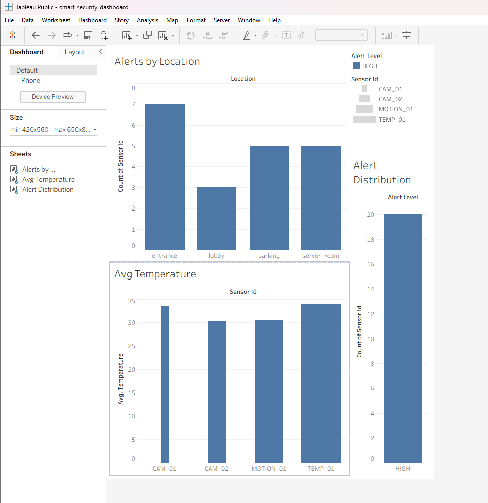

# 🔐 Smart Security Analytics Pipeline

A real-time IoT data pipeline simulating smart security sensors, built entirely in Python. Streams events through a Kafka-compatible message broker, processes and filters alerts, stores them in AWS S3 as a Data Lake, queries via AWS Athena, and visualizes insights on a Tableau dashboard.

## 🏗️ Architecture

```
Simulated Sensors → Redpanda (Kafka) → Python Consumer → AWS S3 → AWS Athena → Tableau
```

## 🛠️ Tech Stack

| Layer | Technology |
|---|---|
| Data Simulation | Python |
| Message Broker | Redpanda (Kafka-compatible) |
| Stream Processing | Python (kafka-python) |
| Storage | AWS S3 (Data Lake) |
| Query Engine | AWS Athena |
| Visualization | Tableau |
| Containerization | Docker |
| Libraries | Pandas, PyArrow, Boto3 |

## 📁 Project Structure

```
smart-security-pipeline/
├── producer/
│   └── sensor_producer.py       # Simulates IoT sensor events
├── consumer/
│   └── faust_consumer.py        # Processes alerts & uploads to S3
├── aws/
│   └── athena_setup.sql         # Athena database & table setup
├── docker-compose.yml           # Redpanda broker setup
├── requirements.txt             # Python dependencies
└── README.md
```

## ⚙️ How It Works

1. **Producer** generates fake sensor readings every 2 seconds — camera triggers, motion detection, temperature readings across 4 locations
2. **Redpanda** acts as the message queue, receiving and holding events
3. **Consumer** reads events in real time, filters only HIGH alerts, batches them and uploads to AWS S3 as Parquet files
4. **AWS Athena** queries the Parquet files directly from S3 using SQL
5. **Tableau** connects to the CSV export from Athena and visualizes the data

## 🚀 How to Run

### Prerequisites
- Python 3.10+
- Docker Desktop
- AWS Account (free tier)

### 1. Clone the repo
```bash
git clone https://github.com/Aaryan-001/smart-security-pipeline.git
cd smart-security-pipeline
```

### 2. Create virtual environment
```bash
python -m venv venv
venv\Scripts\activate
```

### 3. Install dependencies
```bash
pip install -r requirements.txt
```

### 4. Start Redpanda
```bash
docker-compose up -d
```

### 5. Add AWS credentials
In `consumer/faust_consumer.py`, replace:
```python
aws_access_key_id='YOUR_ACCESS_KEY'
aws_secret_access_key='YOUR_SECRET_KEY'
```

### 6. Start Consumer (Terminal 1)
```bash
python consumer/faust_consumer.py
```

### 7. Start Producer (Terminal 2)
```bash
python producer/sensor_producer.py
```

Every 10 HIGH alerts are automatically batched and uploaded to S3.

## 📊 Dashboard



### Charts
- **Alerts by Location** — which areas trigger the most HIGH alerts
- **Avg Temperature by Sensor** — temperature readings per sensor
- **Alert Distribution** — count of alerts by severity level

## ☁️ AWS Setup

1. Create S3 bucket: `smart-security-datalake`
2. Create folders: `processed/` and `athena-results/`
3. Create IAM user with `AmazonS3FullAccess` and
